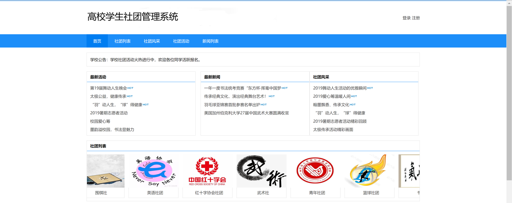
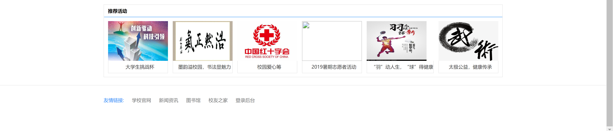
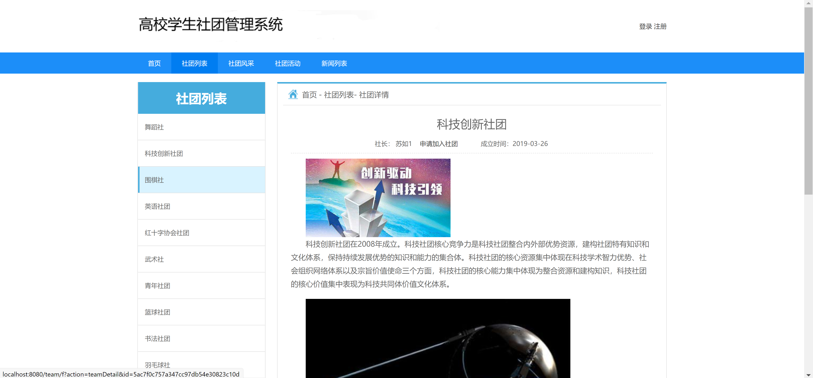
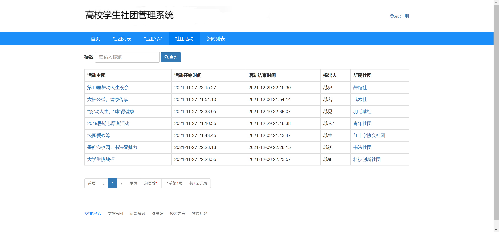
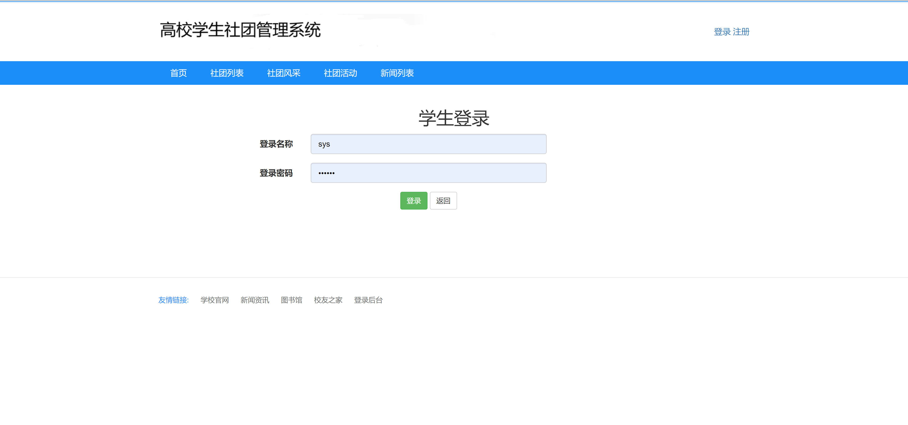
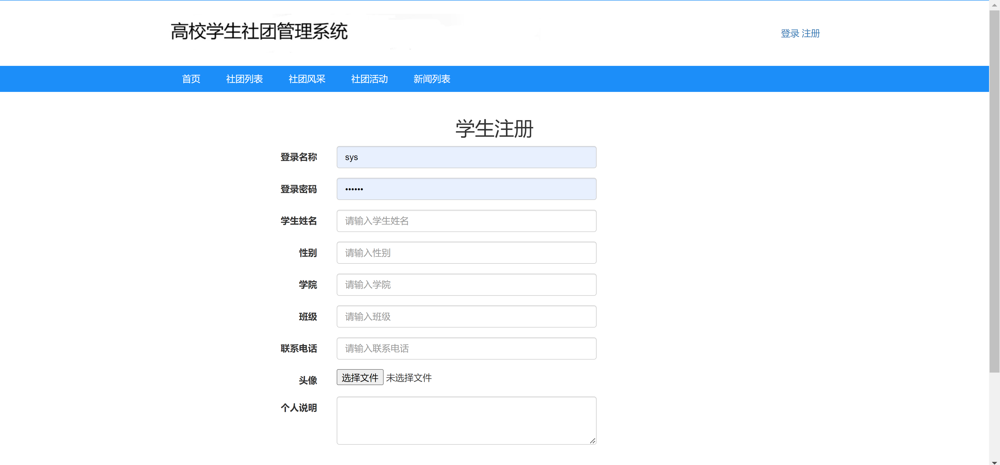
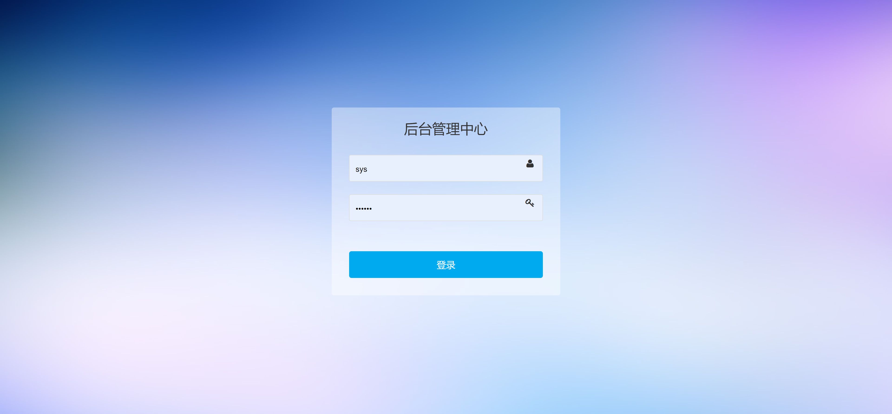
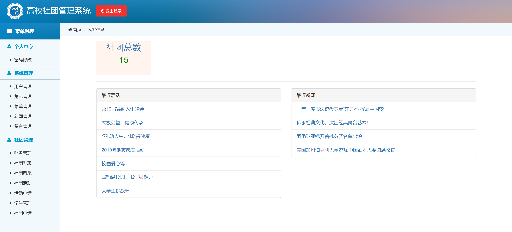

<h1 align="center">高校社团管理系统</h1>

## 简介
高校社团管理系统：角色分为用户和管理员；功能包括用户注册、登录、社团信息查询、活动管理、新闻更新，并提供便捷的链接访问，支持社团信息管理和活动组织。    --计算机毕业设计源码；毕设源码；java毕业设计源码

## 联系方式

<h3 align="center">获取完整代码与数据库文件 + 微信：bysj5151 QQ: 86050149 QQ群: 783742310</h3>

<h3 align="center">可帮忙远程部署 包运行成功！提供远程部署、修改代码、设计文档指导、代码讲解等服务！</h3>

## 功能介绍（完整见运行截图）
学生：基本功能包括登录、注册、上传头像及填写个人信息，如姓名、性别、学院、班级和联系电话。学生可以浏览社团列表、参加社团活动，查看社团风采及新闻资讯，同时有参加及退出社团的选项，便于管理个人社团参与情况。

社团管理员：主要负责社团信息和成员管理，包括查看和批准学生加入申请，组织和发布社团活动以及更新社团简介。通过管理系统查看社团总数和最近活动，便于高效组织和开展社团事务。

系统管理员：负责用户管理、角色管理和系统界面的功能配置。维持系统的正常运行，提供导航栏配置、活动和新闻发布、后台登录及用户权限设定等功能，保证系统的安全性与可用性。

所有用户：可以访问学校官网链接、新闻资讯以及其他资源，通过底部的友情链接快速获取相关信息。同时，通过快速查询和翻页工具，便于查找和浏览社团活动。

## 运行截图

本代码来源于网络,仅供学习参考使用!

